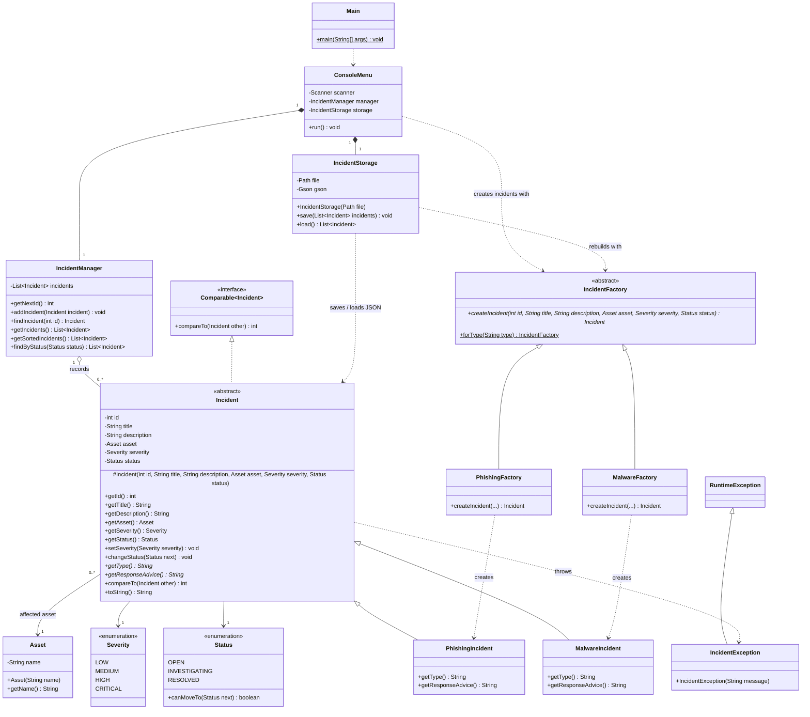

# UML class diagram

GitHub renders this diagram automatically. Editable source: [`uml.mmd`](uml.mmd).

```mermaid
classDiagram
    class Main { +main(String[] args)$ void }
    class ConsoleMenu {
        -Scanner scanner
        -IncidentManager manager
        -IncidentStorage storage
        +run() void
    }
    class Incident {
        <<abstract>>
        -int id
        -String title
        -String description
        -Asset asset
        -Severity severity
        -Status status
        #Incident(int id, String title, String description, Asset asset, Severity severity, Status status)
        +getId() int
        +getTitle() String
        +getDescription() String
        +getAsset() Asset
        +getSeverity() Severity
        +getStatus() Status
        +setSeverity(Severity severity) void
        +changeStatus(Status next) void
        +getType()* String
        +getResponseAdvice()* String
        +compareTo(Incident other) int
        +toString() String
    }
    class PhishingIncident {
        +getType() String
        +getResponseAdvice() String
    }
    class MalwareIncident {
        +getType() String
        +getResponseAdvice() String
    }
    class Asset {
        -String name
        +Asset(String name)
        +getName() String
    }
    class IncidentFactory {
        <<abstract>>
        +createIncident(int id, String title, String description, Asset asset, Severity severity, Status status)* Incident
        +forType(String type)$ IncidentFactory
    }
    class PhishingFactory { +createIncident(...) Incident }
    class MalwareFactory { +createIncident(...) Incident }
    class IncidentManager {
        -List~Incident~ incidents
        +getNextId() int
        +addIncident(Incident incident) void
        +findIncident(int id) Incident
        +getIncidents() List~Incident~
        +getSortedIncidents() List~Incident~
        +findByStatus(Status status) List~Incident~
    }
    class IncidentStorage {
        -Path file
        -Gson gson
        +IncidentStorage(Path file)
        +save(List~Incident~ incidents) void
        +load() List~Incident~
    }
    class Severity {
        <<enumeration>>
        LOW
        MEDIUM
        HIGH
        CRITICAL
    }
    class Status {
        <<enumeration>>
        OPEN
        INVESTIGATING
        RESOLVED
        +canMoveTo(Status next) boolean
    }
    class IncidentException { +IncidentException(String message) }
    class Comparable~Incident~ {
        <<interface>>
        +compareTo(Incident other) int
    }
    class RuntimeException
    Main ..> ConsoleMenu
    ConsoleMenu "1" *-- "1" IncidentManager
    ConsoleMenu "1" *-- "1" IncidentStorage
    ConsoleMenu ..> IncidentFactory : creates incidents with
    IncidentManager "1" o-- "0..*" Incident : records
    Incident "0..*" --> "1" Asset : affected asset
    Incident --> "1" Severity
    Incident --> "1" Status
    Comparable~Incident~ <|.. Incident
    Incident <|-- PhishingIncident
    Incident <|-- MalwareIncident
    IncidentFactory <|-- PhishingFactory
    IncidentFactory <|-- MalwareFactory
    PhishingFactory ..> PhishingIncident : creates
    MalwareFactory ..> MalwareIncident : creates
    IncidentStorage ..> IncidentFactory : rebuilds with
    IncidentStorage ..> Incident : saves / loads JSON
    RuntimeException <|-- IncidentException
    Incident ..> IncidentException : throws
```
